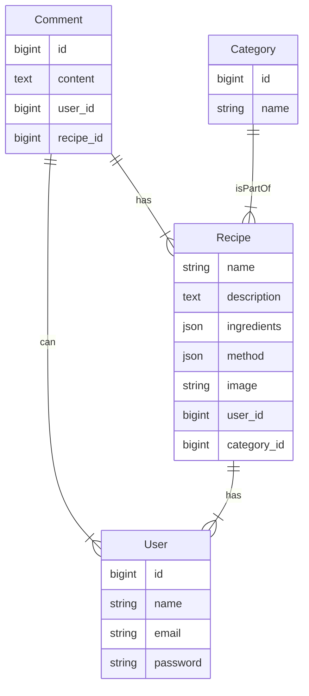



 
# Project Setup
 This setup is mainly for windows users, Linux and Mac users can still use this setup to create Laravel applications, however, there are easier tools in Linux and Mac. 

## IDEs
I am using **PHPStorm** but feel free to use any IDE or text editor.
> **Note:** **JetBrains** are providing their premium products for free to University students for educational purposes. You can register to get the products from this link: https://www.jetbrains.com/community/education/#students

### PHPStorm Plugins
- Laravel Idea
- Laravel Query
#### Theme
GitHub Theme

## SDKs 
#### Node js 18.13.0 LTS
Download from here: https://nodejs.org/en/

## Database Client
I am using DataGrip from **JetBrains**, you can use any client. I also recommend Valentina DB.

## Web Server

We will be using Xampp, it is a preconfigured web server solution package. It will install PHP, APACHE, and MySQL, which is what we need in the project.
I am using **PHP 8.0.x** 
download link: https://www.apachefriends.org/download.html

## PHP Package Manager
Composer is the package manager for PHP and we will use it to install and manage our PHP dependencies.
Download: https://getcomposer.org/download/
> Note: we will go through the installation process in the workshop

## SHELL
I recommend using Git BASH to run commands and to navigate between files. It gives better developer experience than Windows CMD or PowerShell.
Download link: https://git-scm.com/downloads

## Entity Relationship Diagram 

